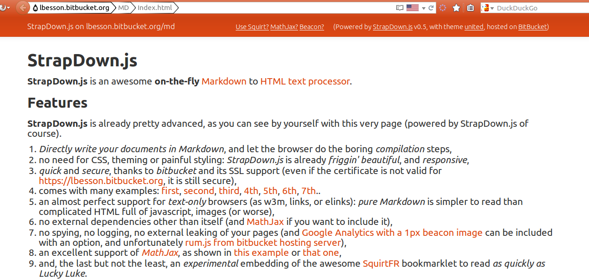
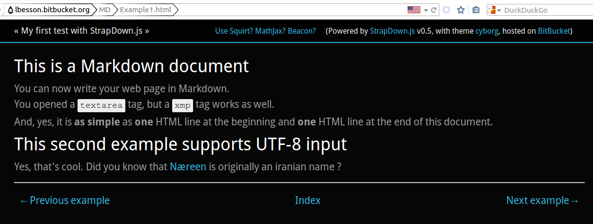
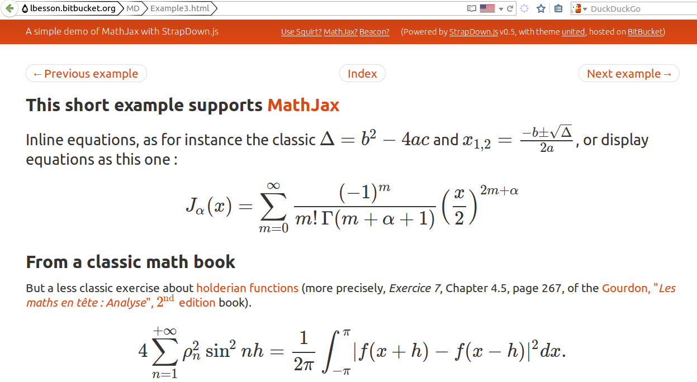
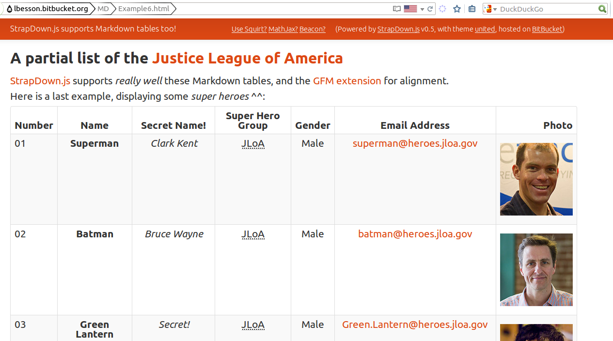
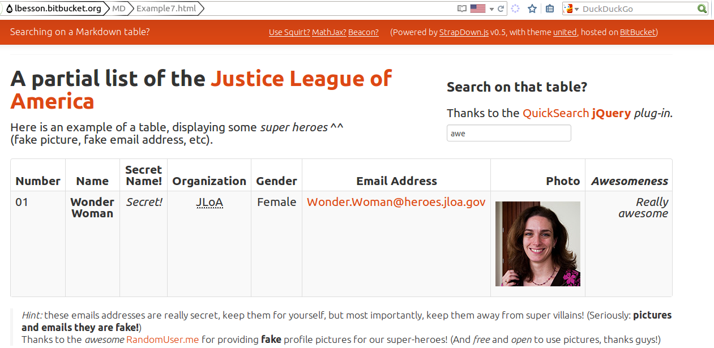

# StrapDown.js (on GitHub)
[StrapDown.js](https://naereen.github.io/StrapDown.js/) is an awesome web script to write nice-looking webpages in pure Markdown, with no server side compilation.

----

## Features :dizzy:
**StrapDown.js** is already pretty advanced:

 1. *Directly write your documents in Markdown*, and let the browser do the boring *compilation* steps,
 2. no need for CSS, theming or painful styling: *StrapDown.js* is already *friggin' beautiful*, and *responsive*,
 3. *quick* and *secure*, thanks to *GitHub* and their great SSL support. Note : You can also use [https://cdn.jsdelivr.net/gh/Naereen/StrapDown.js@master/strapdown.min.js](https://cdn.jsdelivr.net/gh/Naereen/StrapDown.js@master/strapdown.min.js) to load the script from a quick and secure (HTTPS-aware) CDN.
 4. comes with many examples: [first](example1.html), [second](example2.html), [third](example3.html), [4th](example4.html), [5th](example5.html), [6th](example6.html), [7th](example7.html), [8th](example8.html), [9th](example9.html), [10th](example10.html)...
 5. an almost perfect support for *text-only* browsers (as w3m, links, or elinks): *pure Markdown* is simpler to read than complicated HTML full of javascript, images (or worse),
 6. no external dependencies other than itself (and [MathJax](http://www.mathjax.org/) if you want to include it),
 7. no spying, no logging, no external leaking of your pages (and [Google Analytics with a 1px beacon image](http://perso.crans.org/besson/beacon.html) can be included with an option,
 8. an excellent support of [*MathJax*](http://www.mathjax.org/), as shown in [this example](example3.html) or [that one](example5.html),
 9. quite lightweight: ,
 10. and, the last but not the least, an *experimental* embedding of the awesome [SquirtFR](//lbesson.bitbucket.io/squirt) bookmarklet to read *as quickly as Lucky Luke*.
 11. Note : You can also use [https://cdn.jsdelivr.net/gh/Naereen/StrapDown.js@master/strapdown.min.js](https://cdn.jsdelivr.net/gh/Naereen/StrapDown.js@master/strapdown.min.js) to have a true HTTPS support, by loading the script from a quick and secure (HTTPS-aware) CDN.

## Drawbacks? :bug:
But there is also have a few things you need to know before using it:

 1. It might get slow for *very long* pages, even if a **3000-line** document is handled very well and quickl ([you can test by yourself with this long document](3000.html)),
 2. a reduced support for browsers *without javascript* or *with javascript disabled* (the pages are still readable, but really *ugly*),
 3. hosted on [GitHub](https://github.com/) and served by [JsDelivr](https://JsDelivr.com), which are wonderful but *might* not be always available.

## Concretely
Concretely, GitHub is [always](http://status.github.com/) *up*, *secured* and *quick* (oooh, and it is also awesome, completely free, and awesome too). Yeah, *is it so awesome* that I had to say it *twice*, you read it correctly!

But if you prefer, feel free to download the project (with [StrapDown.js.zip](https://bitbucket.org/lbesson/lbesson.bitbucket.org/downloads/StrapDown.js.zip)) and upload it somewhere on your own server, or locally on your machine.

As the script is hosted on [GitHub](https://github.com/Naereen/StrapDown.js/), it can be loaded *quickly* and *securely* from [cdn.JsDelivr.com](https://cdn.jsdelivr.net/gh/Naereen/StrapDown.js@master/strapdown.min.js): [https://cdn.jsdelivr.net/gh/Naereen/StrapDown.js@master/strapdown.min.js](https://cdn.jsdelivr.net/gh/Naereen/StrapDown.js@master/strapdown.min.js)!

> ### A quick "thank you" to the [initial project](https://github.com/arturadib/strapdown/)
> My version of StrapDown.js is a fork of [strapdownjs.com](http://strapdownjs.com), a cool project that [kinda seems dead by now](https://github.com/arturadib/strapdown/graphs/contributors).

----

## Examples :boom:
### Here is a first demo:

----

### [This page](//lbesson.bitbucket.io/md/index.html) explains how to use StrapDown.js:

----

### There is also many [different themes](https://github.com/Naereen/StrapDown.js/tree/master/themes/):

----

### StrapDown.js supports [MathJax](https://www.mathjax.org/), and it's really easy to use!

----

### StrapDown.js also supports [MarkDown tables](https://help.github.com/articles/github-flavored-markdown/#tables):

----

### And as any web-based document, a StrapDown.js powered HTML page can include any Javascript script, like this example which shows a research bar for a table:

----

## More details
More details on [//lbesson.bitbucket.io/md/index.html](//lbesson.bitbucket.io/md/index.html), with examples and extra explanations.

----

## About
### Hacked by [Lilian Besson](https://github.com/Naereen) (Naereen).

### Languages
 - [JavaScript](https://en.wikipedia.org/wiki/Javascript),
 - [HTML 5](https://en.wikipedia.org/wiki/HTML) and [CSS 3](https://en.wikipedia.org/wiki/Cascading_Style_Sheets).

### :scroll: License ? 
[MIT Licensed](https://lbesson.mit-license.org/) (file [LICENSE](LICENSE)).
© [Lilian Besson](https://GitHub.com/Naereen), 2015-16.

